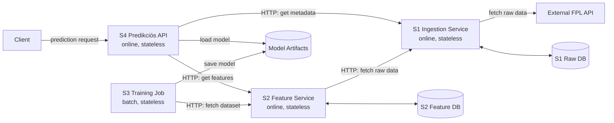

# fpl-points-predictor

Ez a projekt egy teljes FPL pontpredikciós rendszer, amelyben az adatbegyűjtés, a feature-előállítás, a modelltanítás és a predikció külön szolgáltatásokra van bontva.

## Röviden a rendszerről

A cél egy olyan architektúra bemutatása, ahol:

- az `S1` gyűjti be és szolgálja ki a nyers adatokat
- az `S2` feature szolgáltatásként előállítja és elérhetővé teszi a tanításhoz és predikcióhoz szükséges adatokat
- az `S3` külön batch jobként tanít modellt és menti a modellfájlokat
- az `S4` kizárólag az online predikciós API szerepét tölti be

Ez a felosztás jobban illik egy tiszta mikroszolgáltatásos ML rendszerhez, mintha több komponens közvetlenül ugyanazt az adatbázist használná. Minden szolgáltatásnak saját feladata és saját adathozzáférése van, a többi komponens pedig API-n keresztül kapcsolódik hozzá.

## Architektúra

A célarchitektúra ebben a repositoryban:

- `S1`: adatbegyűjtő szolgáltatás
- `S2`: feature szolgáltatás / előfeldolgozó szolgáltatás
- `S3`: training job
- `S4`: predikciós API
- `Postgres`: privát adatbázisok az `S1` és `S2` mögött
- `models/`: verziózott modelltároló

### Szolgáltatási szerepek

| Komponens | Fő szerep | Futási jelleg | Állapotkezelés |
| --- | --- | --- | --- |
| `S1` | Külső FPL adatok begyűjtése és nyers adatok kiszolgálása | Online | Stateless |
| `S2` | Feature pipeline és feature adatok kiszolgálása | Online | Stateless |
| `S3` | Modelltanítás és kiértékelés | Batch job | Stateless |
| `S4` | Publikus predikciós API | Online | Stateless |
| `raw-postgres` | Az `S1` saját nyers adatbázisa | Stateful adattároló | Stateful |
| `feature-postgres` | Az `S2` saját feature adatbázisa | Stateful adattároló | Stateful |
| `models/` volume | Verziózott modellfájlok | Megosztott tároló | Stateful |

Fontos rendszerhatárok:

- az `S3` nem online predikciós szolgáltatás, hanem tanítási komponens
- az `S4` az online predikciós réteg, ez szolgálja ki a klienseket
- az `S1` a saját nyers adatbázisát birtokolja, és API-n keresztül ad hozzáférést a releváns nyers/meta adatokhoz
- az `S2` a saját feature adatbázisát birtokolja, és API-n keresztül szolgálja ki a feature adatokat
- a tartós állapot a PostgreSQL adatbázisokban és a `models/` könyvtárban van, nem magukban az alkalmazáskonténerekben

### Egyszerű architektúra diagram



A nyilak a szolgáltatások közötti kapcsolatokat mutatják, és mindig a meghívott szolgáltatás vagy használt tároló felé mutatnak.

## Miért ezt a mikroszolgáltatásos architektúrát választottam?

Ebben a projektben tudatosan nem közös adatbázis alapú adatátadást választottam, hanem szolgáltatások közötti, azaz service-to-service kommunikációt. Ennek az a lényege, hogy minden szolgáltatás a saját feladatát és a saját adatait kezeli, a többi komponens pedig nem közvetlenül a másik adatbázisát olvassa, hanem az adott szolgáltatás API-ját használja adatelérésre.

A service-ek így sem lesznek teljesen függetlenek egymástól, mert a köztük lévő interfészek és az átadott adatok formátuma továbbra is összehangolást igényel, de tisztább rendszerhatárokat ad, mint a közös adatbázis közvetlen használata.

### Előnyök

- tisztább felelősségi körök: az `S1` adatot gyűjt, az `S2` feature adatot szolgáltat, az `S3` tanít, az `S4` predikciót szolgál ki
- kisebb közvetlen csatolás az adattárolási rétegekhez, mert a komponensek nem egymás tábláit olvassák
- könnyebb cserélhetőség: az `S3` lecserélhető másik tanító komponensre, miközben az `S2` változatlan maradhat
- jobb újrahasznosíthatóság: ugyanaz az `S2` később többféle tanító vagy más belső komponens számára is szolgáltathat feature adatot
- Kubernetes környezetben természetesebben szétválaszthatók az online és batch jellegű komponensek

### Hátrányok

- több belső hálózati kommunikáció szükséges, mint egy közvetlen shared-DB megoldásnál
- nagyobb az üzemeltetési bonyolultság, mert több szolgáltatást és endpointot kell kezelni
- az API-k stabilitása fontosabb lesz, mert a szolgáltatások egymás interfészeire támaszkodnak

### Konkrét példák ebből a projektből

- az `S4` nem közvetlenül a feature adatbázist olvassa, hanem az `S2`-től kéri le a predikcióhoz szükséges feature sorokat
- az `S4` a player metadata-t nem közvetlen SQL-lel veszi ki, hanem az `S1` API-ját hívja
- az `S3` tanító job az `S2` dedikált training endpointjára támaszkodik, és a modell metadata fájlba is elmenti, hogy melyik tanítási adatforrásból dolgozott
- ha az `S1` vagy `S2` belső adattárolása változik, azt könnyebb egy service-határon belül kezelni, mint akkor, ha több másik komponens közvetlenül ugyanazt az adatbázist olvassa

## A repository felépítése

### `S1 - Data Ingestion`

Fő fájlok:

- `src/S1/fpl_api.py`
- `src/S1/download_players.py`
- `src/S1/api.py`
- `src/S1/main.py`

Felelősség:

- nyers FPL adatok lekérése a külső API-ból
- nyers adatok validálása és normalizálása
- nyers adatok mentése a saját PostgreSQL adatbázisába
- nyers és meta adatok kiszolgálása az `S1` API-n keresztül

### `S2 - Feature Service`

Fő fájlok:

- `src/S2/build_dataset_pandas.py`
- `src/S2/merge_difficulty.py`
- `src/S2/add_target.py`
- `src/S2/build_dataset_multiseason.py`
- `src/S2/api.py`

Felelősség:

- nyers adatok lekérése az `S1`-től
- feature dataset előállítása
- target változó generálása
- több évnyi adat egybevonása
- feldolgozott adatok mentése a saját feature adatbázisba
- feature adatok kiszolgálása tanításhoz és predikcióhoz, külön endpointokon

### `S3 - Training Job`

Fő fájl:

- `src/S3/train_and_evaluate.py`

Felelősség:

- tanítóadatok lekérése az `S2` `/training-dataset` endpointjáról
- a tanítási adatforrás metaadatainak mentése a modell metadata fájlba
- modellek betanítása
- baseline és jelölt modellek kiértékelése
- verziózott modellfájlok és metaadatok mentése a `models/` könyvtárba

##### Miért van modellverziózás?

A projektben a modellek nem egyetlen fájlként vannak felülírva, hanem minden tanítás külön verzióként mentődik el a `models/` könyvtárba.

Egy verzióhoz tartozik:

- a kiválasztott production modell
- a scaler
- a többi elmentett összehasonlító modell
- a `metadata.json`, amely tartalmazza a modell típusát, a metricákat, a feature oszlopokat és a tanítási adatforrást
- a `latest.json`, amely megmondja, hogy jelenleg melyik verzió az aktív modell

Miért hasznos ez?

- egy új tanítás nem írja felül nyomtalanul a korábbi modellt
- vissza lehet nézni, hogy egy adott modellverzió miből és milyen eredménnyel készült
- a predikciós szolgáltatás egyértelműen tudja, melyik modellt kell betöltenie (single thruth of source)
- könnyebb összehasonlítani az új és régi modelleket
- egyszerűbb hibát keresni, ha egy későbbi verzió rosszabbul teljesít

Milyen döntések vezettek ide?

- könyvtár alapú verziózást választottam, mert ez egyszerű és átlátható megoldás
- a `latest.json` azért kell, hogy az `S4` ne fájlnevekből vagy mappalistából próbálja kitalálni az aktuális modellt
- a metadata mentése azért fontos, hogy a modellfájl ne önmagában álljon, hanem tartozzon hozzá értelmezhető leírás is
- következő lépés lehet: model registry

Miért fontos a `training_data_source` mentése?

- utólag is vissza lehet követni, hogy pontosan melyik adatforrásból tanult az adott modellverzió
- dokumentálja, hogy melyik endpointból, melyik feature táblából és hány sorból történt a tanítás
- segít a reprodukálhatóságban, mert nem csak a modellt, hanem a tanítás bemenetének forrását is rögzíti
- hiba esetén könnyebb kideríteni, hogy adatforrás-változás vagy modellváltozás okozta-e az eltérést

### `S4 - Predikciós API`

Fő fájlok:

- `src/S4/api.py`
- `src/S4/app.py` (lokális fejlesztéshez)

Felelősség:

- a legfrissebb production modell betöltése
- player metadata lekérése az `S1`-től
- legfrissebb feature sorok lekérése az `S2`-től
- predikciók kiszolgálása HTTP API-n keresztül

## API végpontok

Az alábbi végpontok a jelenlegi szolgáltatásokban érhetők el.

A `healthz` és `readyz` végpontok célja nem ugyanaz:

- a `healthz` azt jelzi, hogy maga a service még él, válaszol, és nem állt le
- a `readyz` azt jelzi, hogy a service nemcsak fut, hanem ténylegesen készen is áll a kérések kiszolgálására

Ez azért fontos, mert Kubernetesben ezekre lehet építeni a későbbi `liveness probe` és `readiness probe` ellenőrzéseket.

### `S1` végpontok

| Metódus | Útvonal | Cél |
| --- | --- | --- |
| `GET` | `/healthz` | Jelzi, hogy az `S1` service él és válaszol |
| `GET` | `/readyz` | Jelzi, hogy az `S1` már használható, és eléri a saját adatbázisát |
| `POST` | `/run` | Az ingestion pipeline futtatása és a nyers adatok betöltése |
| `GET` | `/current-season` | Az aktuális szezon nyers, játékosszintű adatainak lekérése |
| `GET` | `/fixtures` | Fixture adatok lekérése |
| `GET` | `/player-meta` | Játékos metaadatok lekérése az `S4` számára |

Megjegyzés:

- az `S1` végpontjai belső szolgáltatási célokat szolgálnak, főleg az `S2` és `S4` fogyasztja őket

### `S2` végpontok

| Metódus | Útvonal | Cél |
| --- | --- | --- |
| `GET` | `/healthz` | Jelzi, hogy az `S2` service él és válaszol |
| `GET` | `/readyz` | Jelzi, hogy az `S2` már használható, és eléri a saját feature adatbázisát |
| `GET` | `/training-dataset` | Dokumentált tanítási adatforrás az `S3` számára |
| `GET` | `/player-data/latest` | A legfrissebb predikcióhoz szükséges feature sorok lekérése az `S4` számára |
| `POST` | `/run` | A feature pipeline futtatása és a feature tábla frissítése |

Megjegyzés:

- a `/training-dataset` és a `/player-data/latest` külön végpontokon választja szét a tanítási és a predikciós adatfelhasználást

### `S4` végpontok

| Metódus | Útvonal | Cél |
| --- | --- | --- |
| `GET` | `/healthz` | Jelzi, hogy az `S4` service él és válaszol |
| `GET` | `/readyz` | Jelzi, hogy az `S4` használatra kész: a modell be van töltve és a függő service-ek elérhetők |
| `GET` | `/predict` | Predikció készítése a következő fordulóra |

Megjegyzés:

- ez a publikus belépési pont a rendszerhez
- az `S4` a háttérben az `S1`-től metadata-t, az `S2`-től feature adatot, a `models/` könyvtárból pedig az aktuális modellt tölti be

## Jelenlegi Docker Compose megfeleltetés

| Compose service | Architektúra szerinti szerep |
| --- | --- |
| `raw-api` | `S1` adatbegyűjtő szolgáltatás |
| `preprocessing` | `S2` feature szolgáltatás |
| `trainer` | `S3` training job |
| `api` | `S4` predikciós API |
| `raw-postgres` | `S1` privát nyers adattár |
| `feature-postgres` | `S2` privát feature adattár |


## Lokális futtatás

A projekt a `src` könyvtárat használja Python module rootként.

Lokális futtatás előtt állítsd be a `PYTHONPATH` változót:

```bash
export PYTHONPATH=src
```
